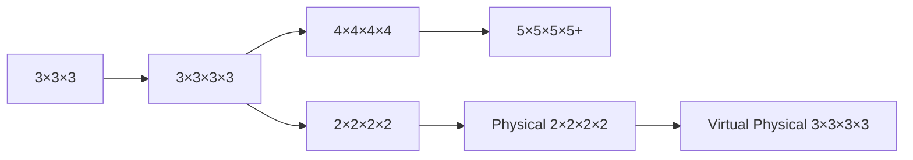
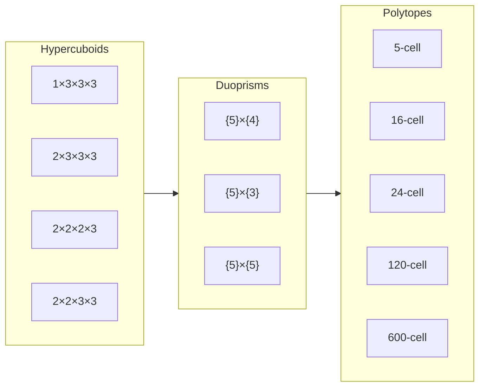
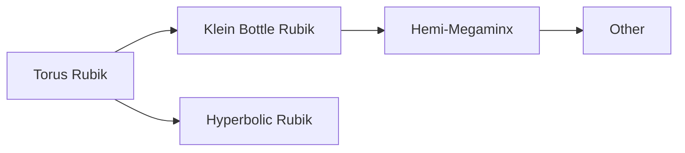
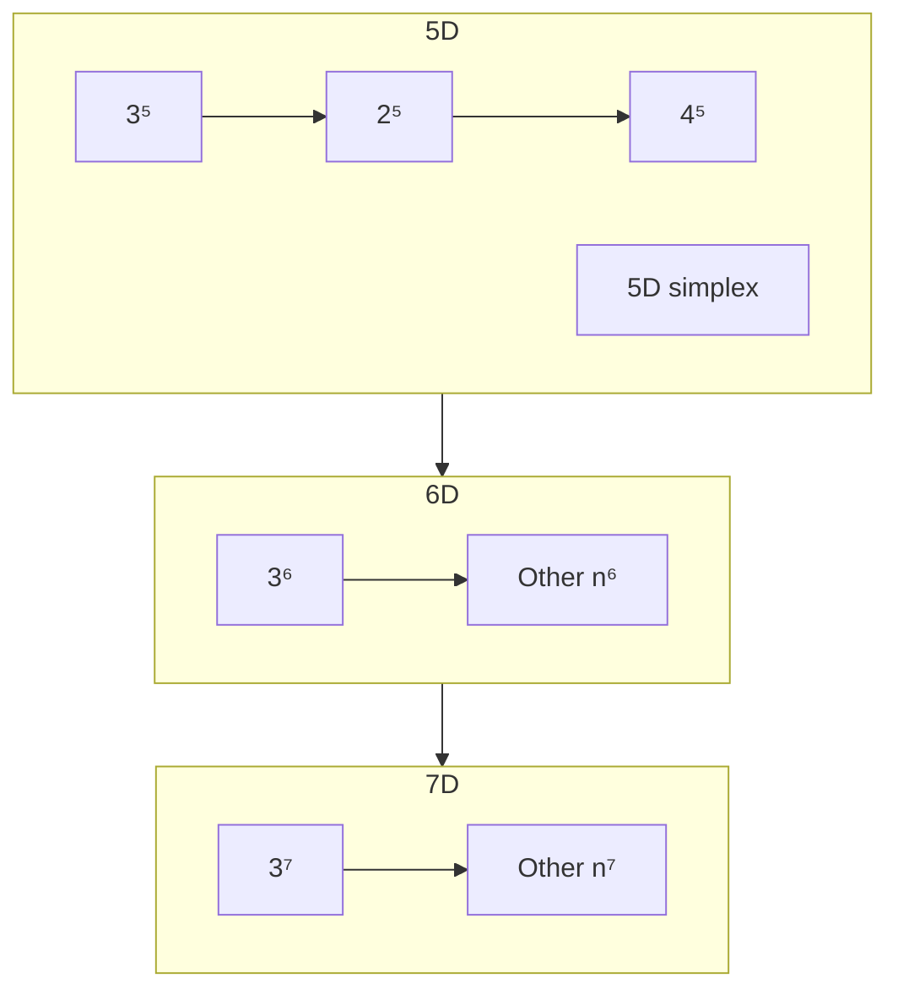

# Progression

This is an outline of how to make your way through the world of hypercubing. Learning puzzles in another order could lead to confusion or an incomplete understanding in the long run.

!!! quote "Hactar"
    It's very difficult to understand what's really going on in a physical puzzle without first understanding virtual puzzles. We recommend starting with virtual 3^4 for the same reason that 3D cubers typically recommend starting with 3×3×3.

## Getting Started

Completely new to twisty puzzles? Never solved a Rubik's Cube? Here's where to start:

[K-Card Game](https://masonhorne.github.io/k-Card-Game/) is a basic piece cycling puzzle using cards. Can you rearrange them into the correct order? After completing it a few times, try and lower your movecount to reach the optimal solution. Also notice how you're always just swapping 2 cards, and you need to do cycles of swaps to rearrange them correctly.

[Loopover](https://loopover.xyz/) is similar to sliding puzzles (such as the infamous 15-puzzle) but there's no missing tile and the board loops over (hence the name). It might look overwhelming, but it's actually recommended to start with a 5x5 size board. After that, try a 4x4 board and discover the differences between odd and even size boards.

Now on to actual twisty puzzles. You only have 1 chance to try and solve a Rubik's Cube by yourself with no tutorial. Definitely give that a shot first if you're brave enough. Otherwise, look up some tutorials and try and get beginners 3D intuition manipulating the cube. If you don't yet own a Rubik's Cube, you can play with this interactive widget below, but it's very much recommended to get a physical puzzle and feel the geometry of it.

       

## N×N×N×N's

First, make sure you know how to solve a 3×3×3 Rubik's Cube. At the very minimum, knowing a beginner's method is enough, but knowing more advanced methods or  techniques, such as blockbuilding or intuitive F2L, could make getting into hypercubing easier. In addition, you should have at least a basic understanding of 4-dimensional space. You can browse our [introduction](/intro-4d.md), or watch some of the hypercubing [playlists](/videos.md).

## Other 4D Puzzles

There are many types of 4D puzzles, not just the hypercubes. These include hypercuboids, duoprisms, reqular 4D polytopes, and more. These puzzles require much more knowledge than just the 3×3×3. You'll need to know how to solve 3D cuboids, and generally be able to figure out new puzzles using [commutators](/techniques/commutators.md).

## Non-Euclidean Puzzles

[MagicTile](http://roice3.org/magictile/) features a bunch of puzzles where the dimensions behave differently. Our normal dimensions are called Euclidean, whereas you can build virtual puzzles using [Non-Euclidean geometry](https://en.wikipedia.org/wiki/Non-Euclidean_geometry). [Magic Hyperbolic Tile {6,3,3}](https://superliminal.com/andrey/mht633/) is a program for a puzzle in 3D hyperbolic space.

## 5D+ puzzles

Jumping to 5D puzzles after solving your first 4D puzzle may seem intimidating. Once you've become familiar with 4D puzzles, making the jump is basically the same as going from 3D to 4D. Start with the 3^5^ and other N^5^ sizes. Then you might want to try some of the 5D hypercuboids or other 5D puzzles in [MPU](/software/magicpuzzleultimate.md). After that you might want to explore even higher dimensions.

