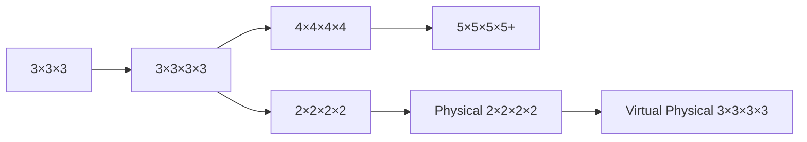
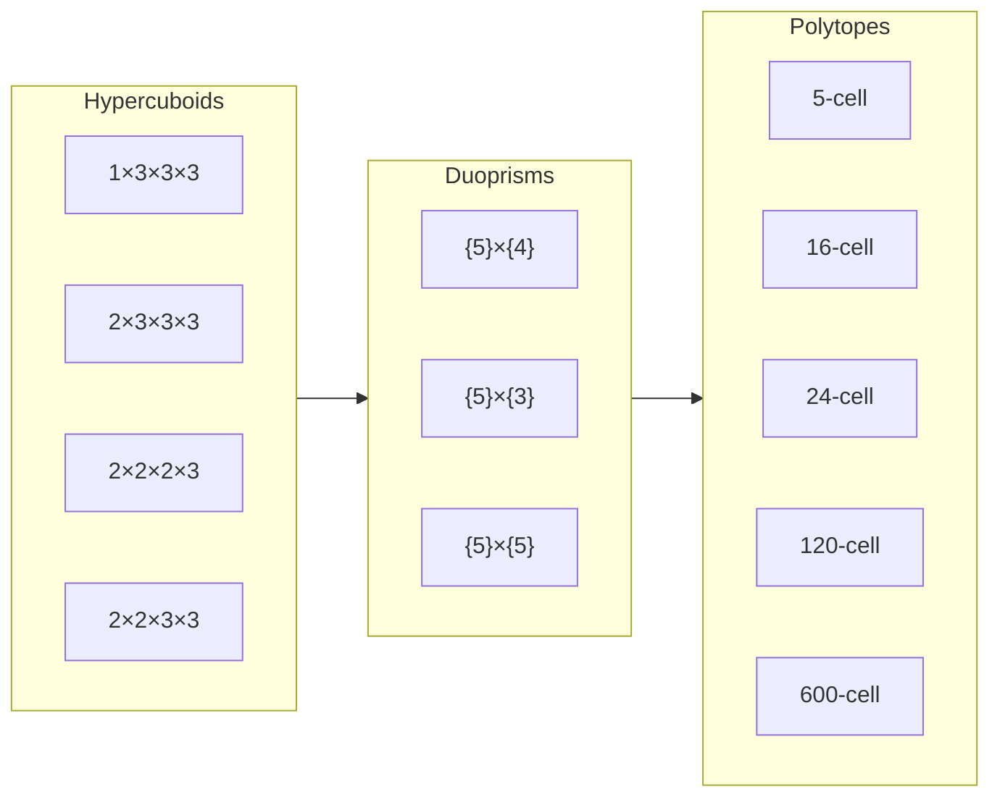
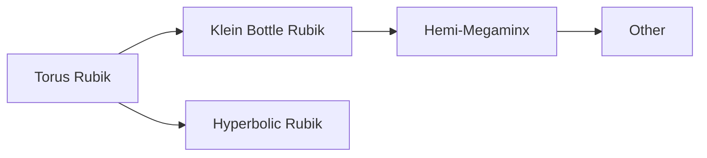
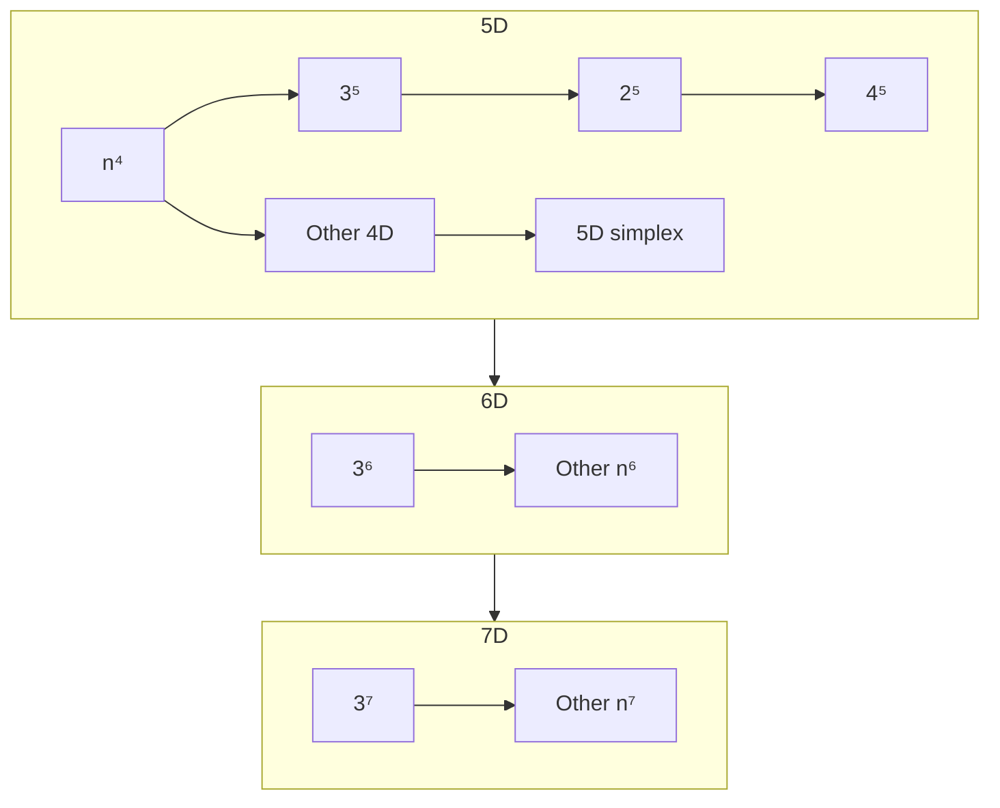

# Progression

This is an outline of how to make your way through the world of hypercubing. Learning puzzles in another order could lead to confusion or an incomplete understanding in the long run.

!!! quote "Hactar"
    It's very difficult to understand what's really going on in a physical puzzle without first understanding virtual puzzles. We recommend starting with virtual 3^4 for the same reason that 3D cubers typically recommend starting with 3×3×3.

## Getting Started

Completely new to twisty puzzles? Never solved a Rubik's Cube? Here's where to start:

[K-Card Game](https://masonhorne.github.io/k-Card-Game/) is a basic piece cycling puzzle using cards. Can you rearrange them into the correct order? Other things to pay attention to when playing:

- Cards in the left vs right hand
- What type of cycles of cards are possible

[Loopover](https://loopover.xyz/) is similar to sliding puzzles (such as the infamous 15-puzzle) but there's no missing tile and the board loops over (hence the name). It might look overwhelming, but it's actually recommended to start with a 5x5 size board. After that, try a 4x4 board and discover the differences between odd and even size boards.

You only have 1 chance to try and solve a Rubik's Cube by yourself with no tutorial. Definitely give that a shot first if you're brave enough. Otherwise, look up some tutorials and try and get beginners 3D intuition manipulating the cube. Good luck!

## N×N×N×N's

First, make sure you know how to solve a 3×3×3 Rubik's Cube. At the very minimum, knowing a beginner's method is enough, but knowing more advanced methods, such as CFOP or Roux, or more advanced techniques, such as blockbuilding or intuitive F2L, could make getting into hypercubing easier.

## Other 4D Puzzles

There are many types of 4D puzzles, not just the hypercubes. These include hypercuboids, duoprisms, reqular 4D polytopes, and more. These puzzles require much more knowledge than just the 3×3×3. You'll need to know how to solve 3D cuboids, and generally be able to figure out new puzzles using [commutators](/techniques/commutators.md).

## Non-Euclidean Puzzles

While most puzzles in MagicTile aren't 4D, they do share some similar concepts due to their strange geometries.

## 5D+ puzzles

