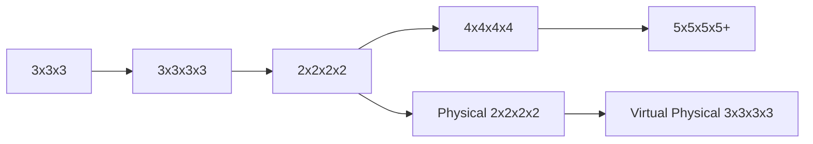
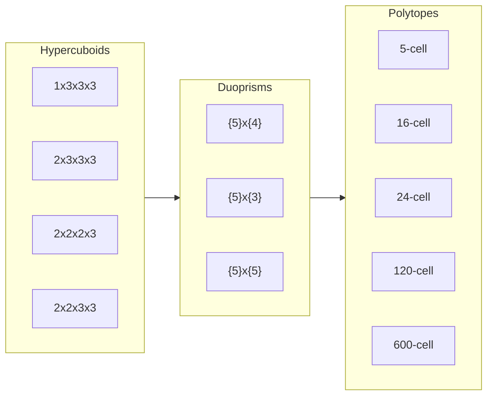
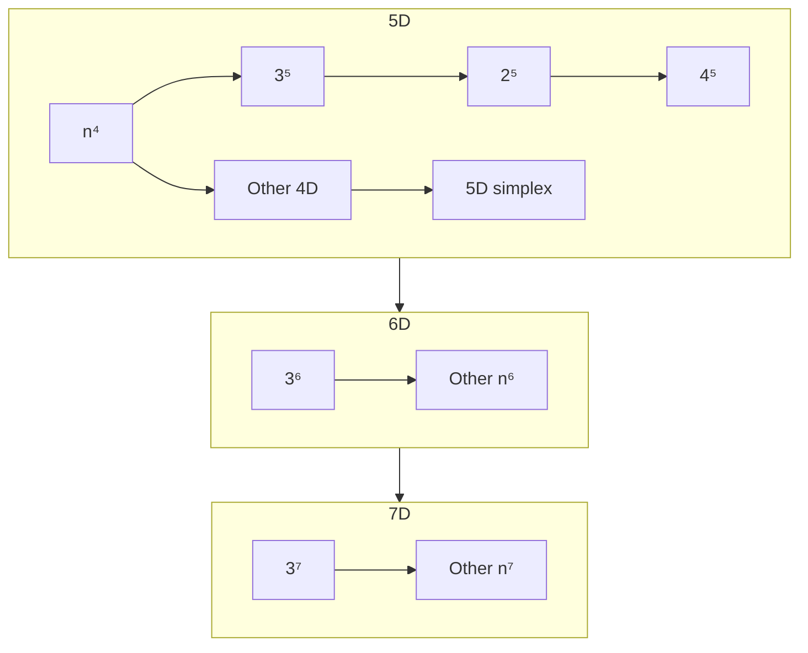

# Progression

This is an outline of how to make your way through the world of hypercubing. Learning puzzles in the wrong order can often lead to confusion, or hindering your understanding in the long run.

!!! quote "Hactar"
    It's very difficult to understand what's really going on in a physical puzzle without first understanding virtual puzzles. We recommend starting with virtual 3^4 for the same reason that 3D cubers typically recommend starting with 3x3x3.

## NxNxNxN's
First, make sure you have good knowledge of the 3x3x3 Rubik's Cube. At the very minimum, how to solve it using a beginner's method, but preferably a more advanced method like CFOP or Roux, and some knowledge of blockbuilding or pairing pieces intuitively.

## Other 4D Puzzles
There are many types of 4D puzzles, not just the hypercubes. These include hypercuboids, duoprisms, reqular 4D polytopes, and more. These puzzles require much more knowledge than just the 3x3x3. You'll need to know how to solve 3D cuboids, and generally be able to figure out new puzzles using [commutators](/techniques/commutators).

## Non-Euclidean Puzzles
While most puzzles in MagicTile aren't 4D, they do share some similar concepts due to their strange geometries.

## 5D+ puzzles

