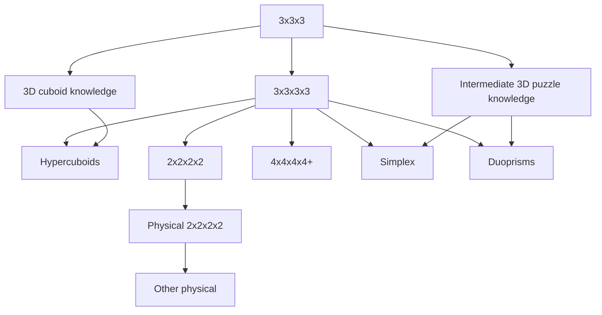

# Flowchart
// This is a rough draft

Just getting started with hypercubing? For the best experience, we recommend learning things in this order:

```mermaid
flowchart TD
    A[3x3x3]
    B[3x3x3x3]
    C[3D cuboid knowledge]
    D[Hypercuboids]
    E[2x2x2x2]
    F[Physical 2x2x2x2]
    G[Other physical]
    H[4x4x4x4+]
    I[Intermediate 3D puzzle knowledge]
    J[Simplex]
    K[Duoprisms]
    B & C --> D
    A --> B
    A --> C
    A --> I
    B --> E
    B --> H
    B & I --> J
    B & I --> K
    E --> F
    F --> G
```